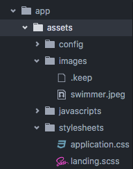
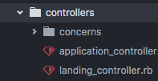
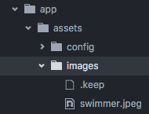
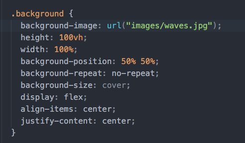
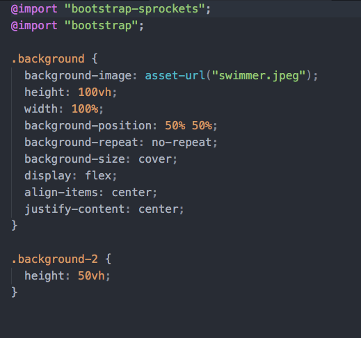

# Day 1 Lessons

- We are looking to build the landing page below. Whilst extremely common to the point of tease, the landing page below serves
as an extremely good base to learn how developers create beautiful landing pages.

  [Sample Landing Page](http://adventurega.me/bootstrap/)

- First and foremost, we'll need to install the relevant libraries to get started.

- Proceed to open your ``` Gemfile ``` and type in ``` gem 'bootstrap-sass' ``` into an empty line on your Gemfile.
  

- Run ``` bundle install ``` to add your new library.

- Next, let's create a new stylesheet called ``` landing.scss ``` inside your
``` app/assets/stylesheets ``` folder.


- Let's then open your newly created scss file and add these 2 lines to the very top of the page.

  ```
  @import "bootstrap-sprockets";
  @import "bootstrap";
  ```

  

- Once that's done, let us build the first part of the sample landing page.

- First and foremost, let's talk a little about the Rails Framework. Rails is a MVC (Model View Controller) web framework
that allows developers to quickly craft web applications. It is built on top of the Ruby Programming Language.

- To server web pages to the user, we must first create a governing controller. Let's go ahead and create a new controller
called ```landing_controller.rb ``` inside the ```app/controllers ``` folder.

  

- Once in there, type the following:

  ```
    class LandingController < ApplicationController

      def index
      end
    end
  ```
- What this does - we are defining a new controller that inherits off ApplicationController as per Rails conventions. The method
``` index ``` means that we are creating a new controller action inside it. Controller actions perform various things such as accepting data
to create a new record, or serving a new web page. In this case, we are creating it to serve a new web page, our home page.

- Once that is done, let us create a new folder called landing under the ```app/views ``` folder. In the ```landing``` folder,
create a new file called ```index.html.erb```.

- Finally, let's hook up the routes so that the application knows that this is the root page.
Open up your ```routes.rb ``` file inside your ```app/config ``` folder and add the following line after
``` Rails.application.routes.draw do ``` line.

  Add the following:
  ```   root to: 'landing#index' ```

- What this does is that ```root to: ``` is a route dsl action that assigns the following controller and action as the home page.
Take a look at 'landing#index' - `landing` is the name of the controller (LandingController) while `index` is the defined method
is the controller class.

- Now that we've got our landing page set up. Let's style it.

- First, let's get a random beautiful photo off the internet. [Unsplash](https://www.unsplash.com) is a
great site for finding pictures. Download one and put it into your ``` app/assets/images ``` folder. This
folder is where you will be storing all your images.

  

- Let's proceed to view the attached sample html file. Open the ``` full_page_centering.html ``` file
in the same folder and have a look at it.

  

- ```background-image``` is the css command to render an image as a background

- ```height ``` is the css setting to set the height of the element. In this case, it is the ```div ```
containing the background image. height can take the values of percentage, pixels of vh - which is view-height
view-height can go from the value 0 to 100 - 100 being the image or element rendered as large as the size of the screen.

- ```width ``` like height is the css settings that sets the width of an element. It runs similar to height, being
able to accept percentage, pixels, or view-width as a value.

- ``` background-position ``` sets the position of the background-image, the first value sets the ``` x ``` axis, while the
second value sets the ``` y ``` axis. Both values go from 0% to a 100%.

- ``` background-repeat ``` sets whether the background-image should repeat itself.

- ``` background-size ``` sets whether the image should cover the entire element.

- ``` display: flex ``` is a css setting that enables the flexbox layout mode. Flexboxes are a layout mode that allows developers
to style and structure their div accordingly and responsively.

- ``` align-items ``` works only with ``` display: flex ```. It will vertically center the nested element.

- ``` justify-content ``` determines how child elements inside a flex element is arranged horizontally. In this case, ``` center ```
aligns the only element into the center.

- Go ahead and copy the css settings above into the ```landing.scss``` file you created earlier. Your `landing.scss` file should now look like this:

  

- Finally, go ahead and add the following into your `index.html.erb` file and run `rails s`

  ```
    <div class="background">
      <div class="content">
        <h1> Welcome to Magic Forums </h1>
      </div>
    </div>
  ```

- Go to `localhost:3000` and look at it.

- Daily Challenge: Now that we've created the full page photo, let's create another one below it. Refer to the sample landing page,
find another photo and set the height to ``` 50 vh ```. Add the text ``` Created for Cool People ```.
